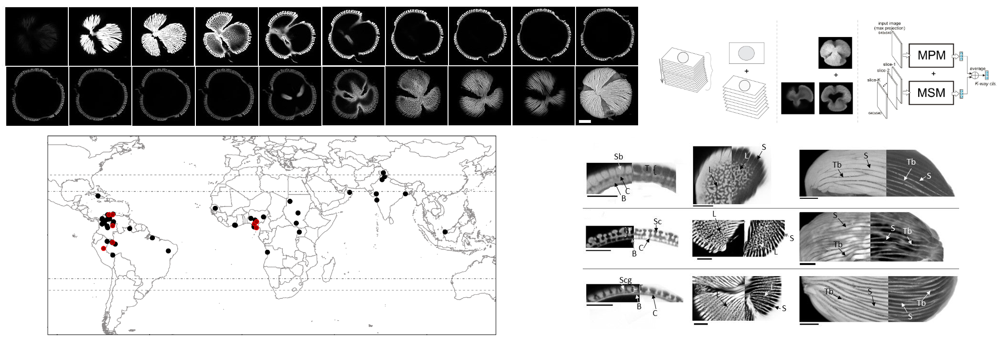

## Reconstructing the Cenozoic Story of the Pollen Striatopollis Catatumbus 

**Authors**: Ingrid C. Romero, Shu Kong, Charless C. Fowlkes, Michael A. Urban, Carlos Jaramillo, Francisca Oboh-Ikuenobe, Carlos D'Apolito, Surangi W. Punyasena

**Last edited**: May 1, 2020 (*this repository is being actively updated*)

**Note**:
This is the codebase/software for our work as titled. The models can be found from the [google drive](https://drive.google.com/open?id=1Qx5tEvGN5OKvTUt1s9u3a8LL4STXuHjt). Please put them under "./demo_step002_testing/models" to run it. 

**Keywords**: 
Airyscan microscopy, automated classification, Detarioideae, machine learning, palynology.

**Significance Statement**: 
We demonstrate that combining optical superresolution imaging with deep learning classification methods increases the speed and accuracy of assessing the natural affinities of fossil pollen taxa. We show that it is possible to taxonomically separate pollen grains that appear morphologically similar under standard light microscopy based on nanoscale variation in pollen shape, texture, and wall structure. Using a single pollen morphospecies, Striatopollis catatumbus, we show that nanoscale morphological variation within the fossil taxon is linked to phylogenetic diversification and coincides with paleobiogeographic distributions. This new approach greatly enhances the use of pollen data in ecological and evolutionary research.

## Abstract

Ecological and evolutionary interpretations of deep-time fossil pollen data are limited by the taxonomic uncertainty of pollen identifications. We present a new approach for fossil pollen analysis that uses optical superresolution microscopy and machine learning to create a higher throughput and quantitative workflow for palynological identifications. We developed three convolutional neural network (CNN) classification models: maximum projection (MPM), multi-slice (MSM), and fused (FM). We trained the models on 16 genera of modern Amherstieae pollen, and then used them to constrain the biological affinities of 48 fossil Striatopollis specimens from the Paleocene, Eocene, and Miocene of western Africa and northern South America. All models achieved average accuracies of 83 - 90% in the classification of the modern genera, and the majority of fossil identifications (86%) showed consensus among at least two of the three models. Our fossil identifications support the paleobiogeographic hypothesis that Amherstieae originated in Africa, followed by early dispersal to South America during the Paleocene-Eocene Thermal Maximum (56 Ma). This is ~10 million years earlier than suggested by the current molecular phylogeny. Our results also provide evidence that at least three Amherstieae genera (Crudia, Berlinia, and Anthonotha) diverged 10-30 million years earlier than predicted by molecular phylogenies.

#
###

contact: [Shu Kong](http://www.cs.cmu.edu/~shuk/)
